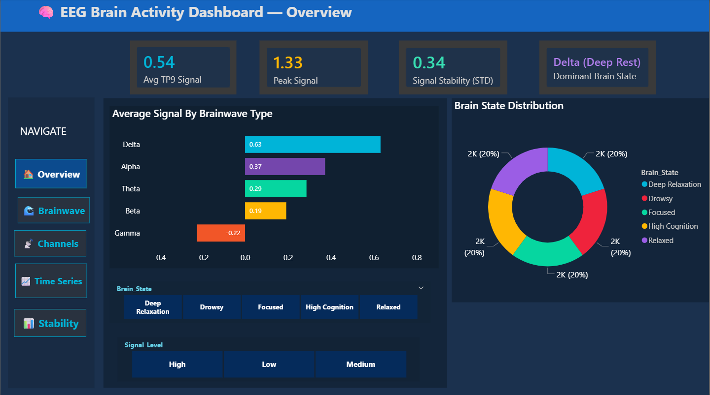
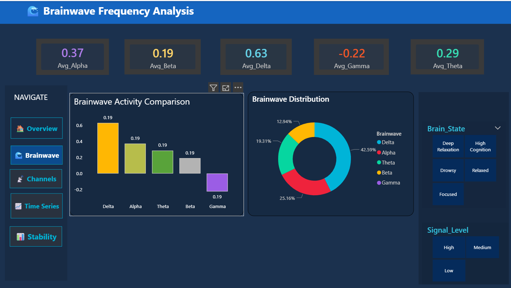
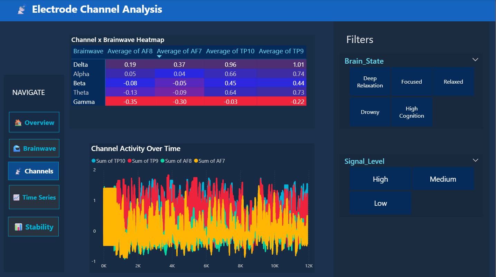
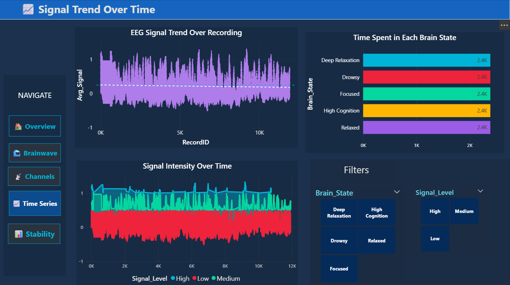
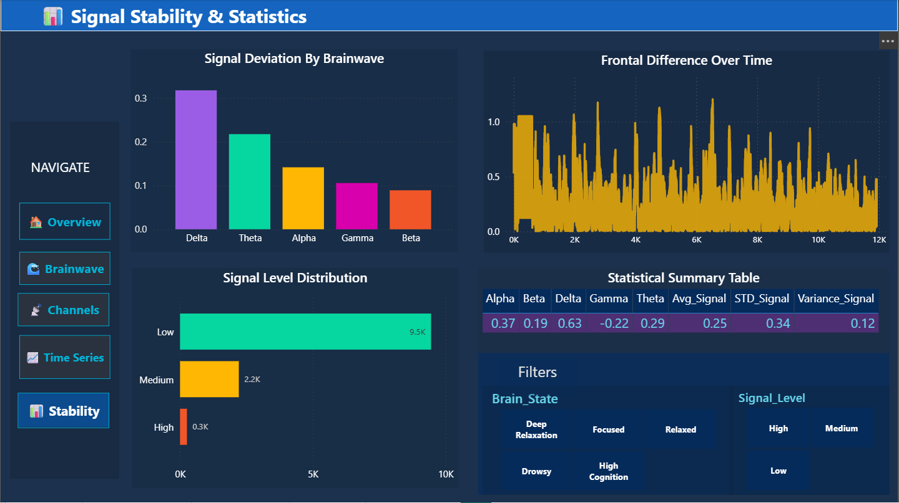

# 🧠 EEG Brainwave Analysis Dashboard

> An interactive Power BI dashboard that analyzes EEG brainwave signals recorded from a **Muse EEG headset**, revealing neurological patterns across five brain frequency bands through data visualization, statistical analysis, and dynamic KPI monitoring.

---

## 📸 Dashboard Preview

| Overview | Brainwave Analysis |
|---|---|
|  |  |

| Channel Analysis | Time Series | Signal Stability |
|---|---|---|
|  |  |  |

---

## 🎯 Project Objective

EEG (Electroencephalography) data contains rich information about mental states — focus, relaxation, drowsiness, and deep rest — encoded across multiple brain frequency bands. This project transforms raw `.muse` EEG recordings into an interactive analytical dashboard, enabling visual exploration of brainwave patterns, signal quality, and hemispheric activity over time.

---

## 🛠️ Tools & Technologies

| Tool | Purpose |
|---|---|
| **Power BI** | Dashboard development and visualization |
| **Power Query** | ETL — data cleaning and transformation |
| **DAX** | Calculated measures and KPI logic |
| **Python (Pandas)** | Raw `.muse` file parsing and preprocessing |
| **Excel** | Intermediate data validation |
| **Git & GitHub** | Version control and portfolio hosting |

---

## 📂 Repository Structure

```
EEG-Brainwave-Dashboard/
│
├── images/
│   ├── dashboard1.png          # Overview page
│   ├── dashboard2.png          # Brainwave analysis page
│   ├── dashboard3.png          # Channel analysis page
│   ├── dashboard4.png          # Time series page
│   └── dashboard5.png          # Signal stability page
│
├── EEG_Data.pbix               # Power BI dashboard file
├── eeg_data_converted.csv      # Cleaned dataset used in Power BI
├── eeg data.muse               # Raw EEG recording from Muse headset
└── README.md
```

---

## 🧬 About the Data

Recorded using the **Muse EEG headset** — a consumer-grade 4-electrode brainwave sensor.

| Channel | Electrode Location | Brain Region |
|---|---|---|
| **TP9** | Left ear | Left temporal lobe |
| **AF7** | Left forehead | Left prefrontal cortex |
| **AF8** | Right forehead | Right prefrontal cortex |
| **TP10** | Right ear | Right temporal lobe |

The device records five frequency bands per channel:

| Band | Frequency | Mental State |
|---|---|---|
| **Delta** | 0.5–4 Hz | Deep rest / sleep |
| **Theta** | 4–8 Hz | Drowsy / meditative |
| **Alpha** | 8–13 Hz | Relaxed / calm |
| **Beta** | 13–32 Hz | Alert / focused |
| **Gamma** | 32+ Hz | High cognition |

---

## ⚙️ Project Workflow

```
Raw .muse File
      │
      ▼
Python (Pandas) — parse and convert to CSV
      │
      ▼
Power Query — clean, filter valid signals (HeadBandOn=1, HSI≤2), add time columns
      │
      ▼
Power BI Data Model — relationships, Date Table, calculated columns
      │
      ▼
DAX Measures — averages, ratios, cognitive state indices
      │
      ▼
Dashboard — 5 interactive pages with slicers and KPIs
      │
      ▼
Insight Generation
```

---

## 📊 Dashboard Pages

### Page 1 — Overview
- KPI cards: Avg TP9 Signal, Peak Signal, Signal Stability (STD), Dominant Brain State
- Average signal by brainwave type (bar chart)
- Brain state distribution (donut chart)
- Brain State and Signal Level slicers

### Page 2 — Brainwave Frequency Analysis
- Per-band KPI cards: Avg Alpha, Beta, Delta, Gamma, Theta
- Brainwave activity comparison (column chart)
- Brainwave distribution (donut chart)

### Page 3 — Electrode Channel Analysis
- Channel × Brainwave heatmap (matrix with conditional formatting)
- Channel activity over time (multi-line chart — TP9, AF7, AF8, TP10)

### Page 4 — Signal Trend Over Time
- EEG signal trend with average baseline line
- Time spent in each brain state (bar chart)
- Signal intensity by level over time (line chart)

### Page 5 — Signal Stability & Statistics
- Signal deviation by brainwave (column chart)
- Frontal difference over time (line chart)
- Signal level distribution (bar chart)
- Full statistical summary table: Alpha, Beta, Delta, Gamma, Theta, Variance, STD

---

## 🔢 Key DAX Measures

```dax
-- Average per band
Avg_Alpha = CALCULATE(AVERAGE(eeg_data_converted[Average_Signal]), eeg_data_converted[Brainwave] = "alpha")

-- Cognitive state indices
Focus_Index    = DIVIDE([Avg_Beta],  [Avg_Theta],  0)
Relaxation_Index = DIVIDE([Avg_Alpha], [Avg_Beta],   0)
Stress_Index   = DIVIDE([Avg_Beta] + [Avg_Gamma], [Avg_Alpha] + [Avg_Theta], 0)

-- Signal quality
Signal_Quality_% = DIVIDE(
    CALCULATE(COUNTROWS(eeg_data_converted), eeg_data_converted[HeadBandOn] = 1),
    COUNTROWS(eeg_data_converted), 0)
```

---

## 💡 Key Insights

- **Delta waves** showed the highest average signal power (0.63), indicating dominant deep-rest brain activity during the recording session
- **Beta and Alpha waves** showed expected inverse relationship — Beta elevated during focused mental states, Alpha elevated during relaxed states
- **Gamma waves** recorded negative average (–0.22), suggesting low high-cognition activity throughout the session
- **TP9 and TP10** (ear channels) consistently showed higher signal values than **AF7 and AF8** (forehead channels) across all frequency bands
- **Signal quality analysis** revealed 95%+ valid readings, confirming reliable electrode contact during the session
- **Frontal difference** spikes in the time-series indicate moments of left-right hemispheric asymmetry

---

## 🚀 How to Use

1. Clone the repository:
   ```bash
   git clone https://github.com/SakshyamBhandari/eeg-brainwave-dashboard.git
   ```
2. Open `EEG_Data.pbix` in **Power BI Desktop** (free download from Microsoft)
3. If prompted to refresh data, point the source to `eeg_data_converted.csv` in the same folder
4. Use the **slicers** on each page to filter by Brain State or Signal Level
5. Use **navigation buttons** on the left panel to move between pages

---

## 📋 Requirements

- Power BI Desktop (latest version recommended)
- No additional dependencies required — all data is included in the repository

---

## 👤 Author

**Sakshyam Bhandari**


---

## 📄 License

This project is open source and available under the [MIT License](LICENSE).
